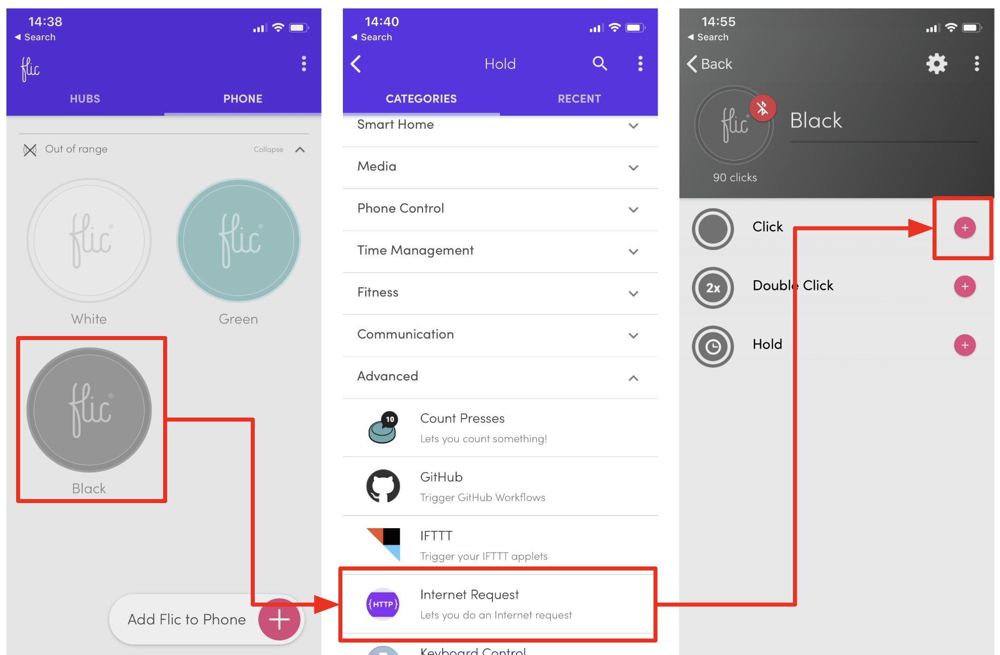

# Using Flick buttons with Cloud Run on GCP


A co-worker recently told me about [flic.io](https://flic.io/) buttons. These button caught my attention because they can include triggers for single, double, or hold click and can be easily wired up to all kinds of actions.

I instantly thought of of a few really interesting applications. To start with though, I wanted to create a simple service that would allow me to push the custom data defined on each button over HTTP to Cloud PubSub. That in turn would then connect me to the many more actuation options through GCP APIs and services that connect to Cloud PugSub.

I went ahead and ordered [4-pack](https://flic.io/shop/flic-4pack) of Flic buttons and chose [Cloud Run](https://cloud.google.com/run/) to implement my `buttons` service.

In this demo I will illustrate how to:

* Deploy Cloud Run service that will persist sent data to Cloud PubSub
* and, how to configure Flic buttons to sent data to Cloud Run service

## Prerequisites

* Configured gcloud CLI (Cloud SDK) for your operating system ([how-to](https://cloud.google.com/sdk/gcloud/)) with default application credentials:
  * `gcloud auth application-default login`
* Enabled GCP APIs for Cloud PubSub and Cloud Run
  * `gcloud services enable pubsub.googleapis.com`
  * `gcloud services enable run.googleapis.com`

## Deployment

### Cloud PubSub Topic

To store the data sent from each button action, first, we need to create a Cloud PubSub topic named `clicks`

```shell
gcloud pubsub topics create clicks
```

That should result with

```shell
Created topic [projects/YOUR_PROJECT_ID/topics/clicks].
```

### Cloud Run Service

Next deploy the generic Cloud Run service called `buttons`. The code for that service is in this repository for you to review. There is already a public image available (see below), but if you want to, you can build your own copy with this command:

```shell
gcloud builds submit --tag gcr.io/YOUR_PROJECT_ID/buttons:0.1.1
```

> For more information on how to build images using Cloud Build see [here](https://cloud.google.com/run/docs/quickstarts/build-and-deploy). You can skip the build step and use the already pre-built public image located at `gcr.io/knative-samples/buttons:0.1.1`

Before we deploy the Cloud Run service we have to create a `secret` which will be used to ensure that only data from your button will be accepted. To do that, replace the `your-long-and-super-secret-string` string below with something more secure and define it as an environment variable using this command:

```shell
export SECRET="your-long-and-super-secret-string"
```

> For more secure way to defining secrets in Cloud Run environment variables you can use the [berglas](https://github.com/GoogleCloudPlatform/berglas) library.

Now that we have the `SECRET` defined, you can deploy the Cloud Run service. A couple of flags worth highlighting in the bellow command:

* `concurrency` - the button service is thread safe and doesn't store any internal state so we can turn the concurrency to maximum. More on concurrency [here](https://cloud.google.com/run/docs/about-concurrency)
* `allow-unauthenticated` - By default Cloud Run creates private services which can't be accessed by anonymous users. Since our buttons don't support more complex authentication scheme, we will expose the Cloud Run service to the public and validate each request using `token` string in request header. More on allowing public access [here](https://cloud.google.com/run/docs/authenticating/public)


```shell
gcloud beta run deploy buttons \
    --region=us-central1 \
    --concurrency=80 \
    --allow-unauthenticated \
    --image=gcr.io/knative-samples/buttons:0.1.2 \
    --update-env-vars="SECRET=${SECRET}"
```

The response from the above command should look something like this

```shell
Deploying container to Cloud Run service [buttons] in project [YOUR_PROJECT_ID] region [us-central1]
✓ Deploying... Done.
  ✓ Creating Revision...
  ✓ Routing traffic...
  ✓ Setting IAM Policy...
Done.
Service [buttons] revision [buttons-00001] has been deployed and is serving traffic at https://buttons-*******-uc.a.run.app
```

You should be able to see that service in Cloud Run service list

```shell
$: gcloud beta run services list
   SERVICE   REGION       LATEST REVISION  SERVING REVISION  LAST DEPLOYED BY     LAST DEPLOYED AT
✔  buttons   us-central1  buttons-00001    buttons-00001     mchmarny@*****.com   2019-06-01T00:10:06.059Z
```

You can also test the deployed service using `curl`. Just make sure you replace the `***` part of the URL with the actual `URL` returned by the above command.

```shell
curl -H "content-type: application/json" -H "token: ${SECRET}" \
    -d '{ "version": "v0.1.0", "type": "button", "color": "white", "click": 1 }' \
    -X POST https://buttons-*******-uc.a.run.app
```

You can always find the URL of your `buttons` service by executing the following command

```shell
gcloud beta run services describe buttons --project YOUR_PROJECT_ID --region us-central1 --format 'value(status.domain)'
```

## Configuring Flic Button

To setup Flic buttons on your device follow the [quick start instructions](https://start.flic.io/). Each one of the Flic buttons come with many [pre-programmed actions](https://flic.io/all-functions).


To execute above configured Cloud Run service though we will use the `Internet Request` action. To do that you will need to select one of your buttons on your device, expand the `Advanced` category, and configure an action for either `single`, `double`, or `hold` click.



That will get you to the `HTTP Internet Request` action configuration screen


Few fields to configure here:

| Parameter        | Description                                                                                                                                                                                 |
| ---------------- | ------------------------------------------------------------------------------------------------------------------------------------------------------------------------------------------- |
| **URL**          | The full URL of the Cloud Run Service                                                                                                                                                       |
| **Method**       | Select `POST`                                                                                                                                                                               |
| **Content Type** | `application/json`                                                                                                                                                                          |
| **Body**         | JSON payload to send to the service (e.g. `{ "type": "button", "color": "white", "click": 1 }`)                                                                                             |
| **HTTP Header**  | Kye: `token`, Value: the value of the previously defined `SECRET`. Make sure you click the `Insert` button to "save" the header parameter before clicking `Done` to save the entire action. |

Now your Flic button is configured for use with Cloud Run

## Demo

Assuming all the above deployment steps were completed successfully, you should be able to click the button and see the following in GCP:

1. **Entries in the Cloud Run service log**


2. **Entries in the Cloud Run metrics chart**


3. **Stackdriver PubSub topic (`clikc`) metric chart**


## Summary

Hopefully this demo gave you an idea on how to connect Cloud Run services to IOT devices. With the basic implementation in place we can start working on more creative solutions.


